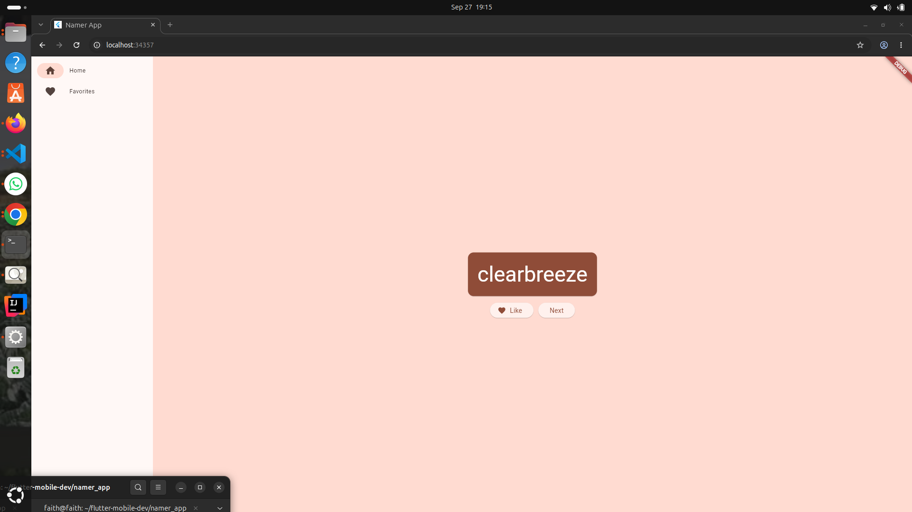
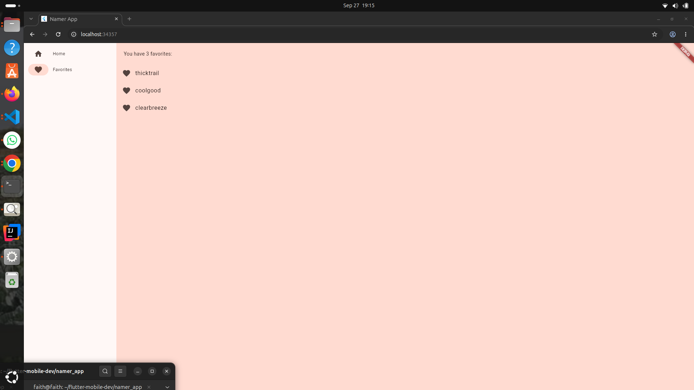

# Namer App

A Flutter app that generates random word-pair name ideas, lets you favorite the
ones you like, and browse your favorites on a separate page. Built as part of
the [Your First Flutter App](https://codelabs.developers.google.com/codelabs/flutter-codelab-first)
codelab.

## What it does

- Generates a random word pair (e.g. "massjob", "hornstreak") on load
- **Next** button generates a new random pair
- **Like** button saves/unsaves the current pair to a favorites list
- A responsive navigation rail switches between the generator and a
  Favorites page listing everything you've liked
- The nav rail automatically shows text labels next to its icons once the
  window is wide enough (≥600px), and just icons on narrower screens

## Screenshots

| Home | Favorites |
|---|---|
|  |  |
## Running it